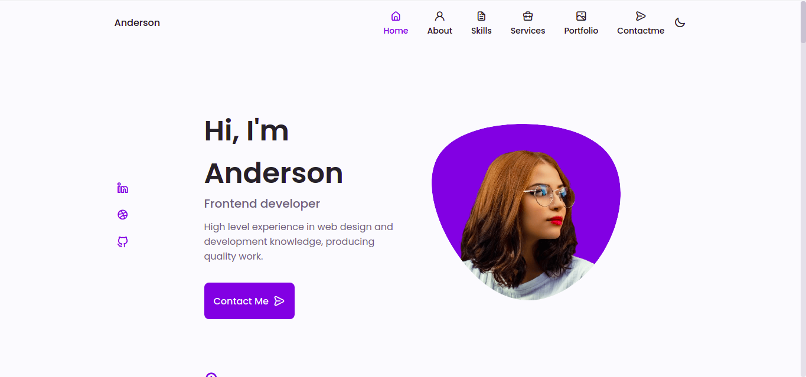

# SitePortfolio

## Como foi feito o site?

 Esse proejto foi desenvolvido com o suporte de um [tutorial](https://www.youtube.com/watch?v=27JtRAI3QO8&t=1s) disponibilizado pelo [canal Bedimcode](https://www.youtube.com/channel/UCgkDs77BoEhMIgRUB4MKrtQ) do Youtube.
 
 ## Tecnologias utilizadas
 
 As tecnologias utilizadas no projeto foram:
 
 - HTML
 - CSS
 - JavaScript

### Observações
 Apesar de eu ter concluído o tutorial, ainda não tive o tempo necessário para modificar os conteúdos do projeto, isto é: ainda não coloquei fotos minhas e nem meus dados pessoais, pretendo fazer isso futuramente.
